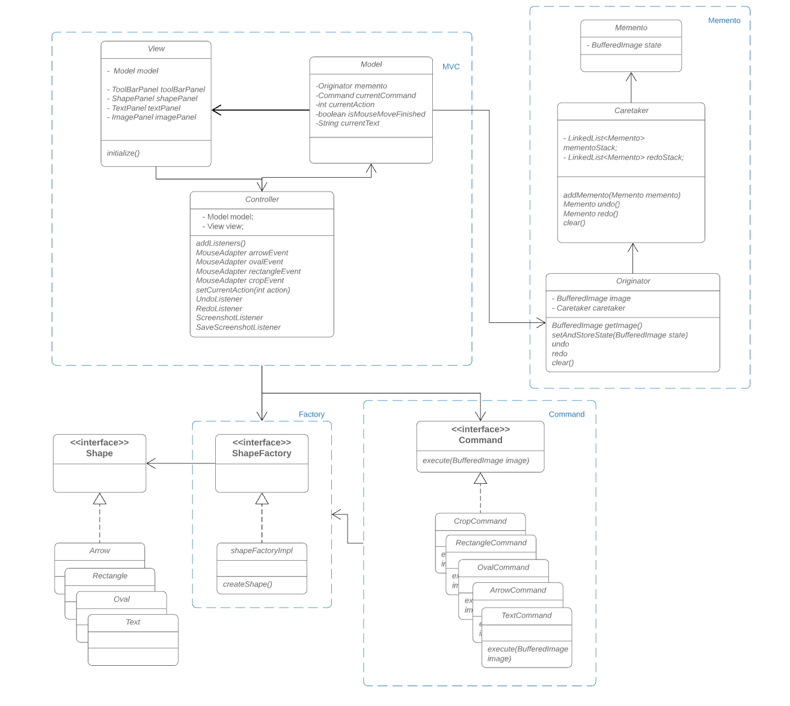

# Application Description

A basic screenshot tool based on Java swing made for Windows.
This application follows the OOP design principles and various designed patterns.

### Why?
In Windows, the snipping tool doesn't support straight line, shape, or text features. 
Whenever I need to annotate a screenshot image, I have to capture the screenshot with the snipping tool and then edit it in PowerPoint. 
After finish editing, I have to recapture the image to save it.

Therefore, the goal is to make a really basic application that allows me to capture the screen, and support some basic features.

## Main Features
* capture the fullscreen and then crop the desired region.
* annotate the screenshot by adding text and shapes
* drag and draw shapes like oval, rectangle, and arrow 
* multilevel undo, redo
* save the screenshot as .jpg

The application is flexible and very straightforward. 
In the future, more shapes can be added just by simply creating a concrete object class and a concrete command class that implements the interfaces.
Moreover, more features can be developed without too much trouble. A color selection feature would be added in the next step.

## Design Patterns
The following patterns are implemented in this application.

#### MVC Pattern

The MVC pattern is used in this application. It separates the application's concerns into Model, View, Controller.
* Model: carrying the data
* View - the GUI of this application
* Controller - It acts on both model and view. It controls the data flow into the model object and updates the view whenever data changes. 
It keeps view and model separate.

#### Memento (Snapshot) Pattern
The Memento pattern, also know as Snapshot pattern, is used in this project to provide multilevel undo and redo features. 
In this project, there are three classes related to this pattern.
* The Memento class is a value object that acts as a snapshot of the originator’s state. 
It is immutable and the data is passed via the constructor only once. In this project, the Memento contains a BufferedImage attribute.

* The Caretaker class takes care of the memento object and normally it maintains a stack of mementos.
The caretaker retrieves the topmost memento whenever there is a undo command.
In order to achieve a multilevel undo/redo feature, in addition to the memento stack, there is another redoStack that keeps track of all the redo snapshots for the redo() method.

* The Originator class can produce snapshots of its own state, as well as restore its state from snapshots when needed. The CareTaker class is nested in here. 

#### Command Pattern 

A request is wrapped under an object as command and passed to invoker object. 
Invoker object looks for the appropriate object which can handle this command and passes the command to the corresponding object which executes the command.

There are ArrowCommand, RectangleCommand, OvalCommand, CropCommand, and TextCommand concrete classes that implement the command interface. These classes will do the actual command processing.
The controller class acts as an invoker object which can place command.

### UML Diagram

### Demo Screenshot
